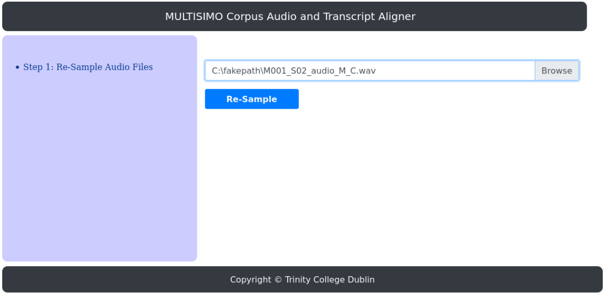
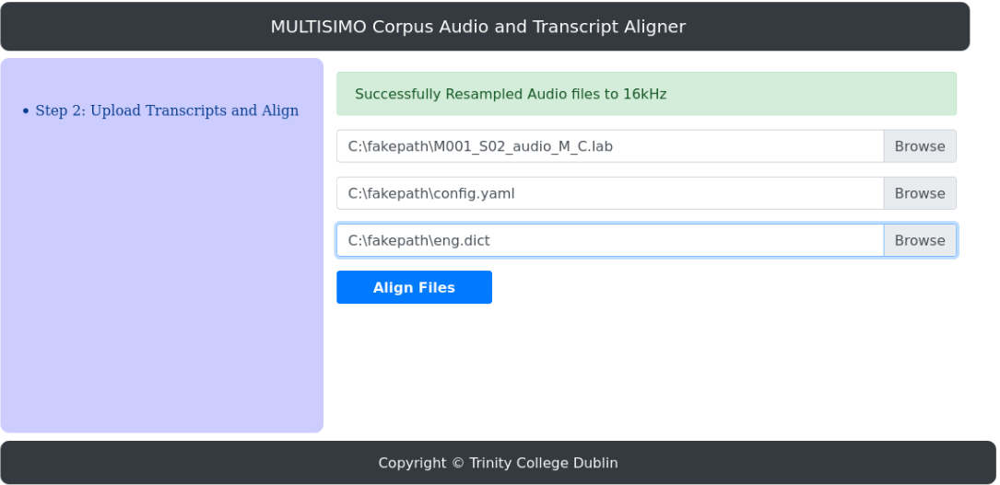
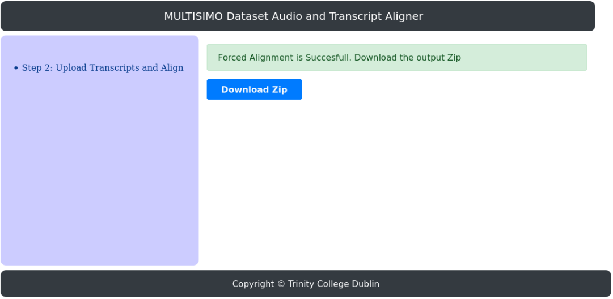
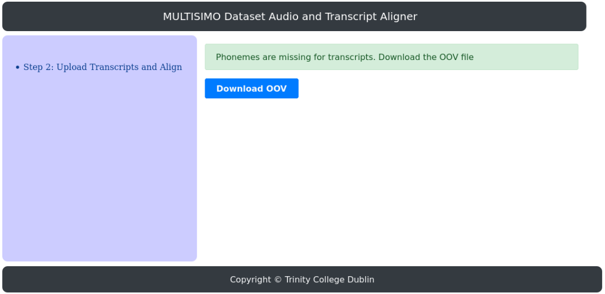

# Automated Forced Temporal Alignment of MULTISIMO Transcripts with Speech Signals
----

This is the research work carried out for the fulfilment of master’s degree at UNIVERSITY OF TRINITY (TCD), DUBLIN.
The  main  focus  of  this  research  work  is  aligning  lengthy  MULTISIMO  audio  files, which  contain  ***”Continuous  Speech  Signals”***  of  approximately  10  minutes  to  its  respective Transcripts automatically and accurately.  A user-friendly web application is designed and developed to solve this time-based alignment problem, that provides ac-curate  results  even  with  noisy  audio  inputs.   Temporal  alignment  helps  linguists  tantalize the language at Phonetic and Word level.  With this ***”Forced Aligner Application”***, analysing audio signals which have a higher signal-to-noise ratio is easy and accurate. 

The focus of Forced Aligner is also to identify the Pronunciations and Syllables in the Speech Signals, which will be useful in training Speech Recognition Systems. This Temporal Forced Aligner Web Application produces Alignments with a accuracy level of ~77% compared to Manual Alignment and takes only ~4 minutes. The Web application is already hosted in Azure Virtual Machine, but public access is not provided to users. Hence to execute and align the code following steps need to be followed.

### Steps to be followed to Run the Forced Aligner Flask Web Application Locally
----
This Project code is available in the root folder of the project repository "ForcedAlignerWebApplication". 
##### Pre-requisites: 
- Ubuntu OS
- HTK Toolkit 
- Python 3 and Flask dependencies
- SOX

##### Install HTK Toolkit
HTK is the "backend" that powers the aligner. It can be downloaded from the "http://htk.eng.cam.ac.uk/download.shtml". Once it's downloaded in the Ubuntu machine, navigate to the extracted root folder of the package and execute below commands.
```
    $ cd htk
    $ export CPPFLAGS=-UPHNALG
    $ ./configure --disable-hlmtools --disable-hslab
    $ make clean    # necessary if you're not starting from scratch
    $ make -j4 all
    $ sudo make -j4 install
```
##### Install Python 3
Follow the below steps to install python3 if it's not present.
```
    $ ruby -e "$(curl -fsSL https://raw.githubusercontent.com/Homebrew/install/master/install)"
    $ brew install python3
    $ apt install python3-pip
```
##### Install SOX
SoX is the "Swiss Army knife of sound processing programs", and can be used to resample the audio files:
```
    $ brew install sox
```
    
### Code Execution
----
The FLASK Web application starts by running 'app.py' using any IDE or through terminal. On the start of the FLASK server the application can be accessed with the localhost URL from the browser. The web application looks like as shown in the Figure 1. The user is provided with option to upload the wav files, lab files, config and dictionary file to perform automated alignment of speech with the transcripts as in Figure 2. Missing words pronunciations in the Dictionary file will be available for download as in Figure 4 and the user can update the pronunciation in the dictionary and Restart the alignment process. On successful completion of the alignment process the users are provided with download zip option button to get the output file as in Figure 3.

<p align="center">Figure 1: Forced Aligner Resampling Audio Files</p>
<p align="center">
  
</p>


<p align="center">Figure 2: Forced Alignment</p>
<p align="center">
  
</p>


<p align="center">Figure 3: Download the Aligned Zip</p>
<p align="center">
  
</p>


<p align="center">Figure 4: Download Out-of-Vocabulary word file</p>
<p align="center">
  
</p>


### Contributions
----
- The main contributor for this research work is **Kavya Bhadre Gowda** and the work is carried out under the supervision of professor **Dr. Carl Vogel.**

### License
----
Contributions are welcomed.

### Copyright 
----
Copyright © University of Trinity, Dublin
